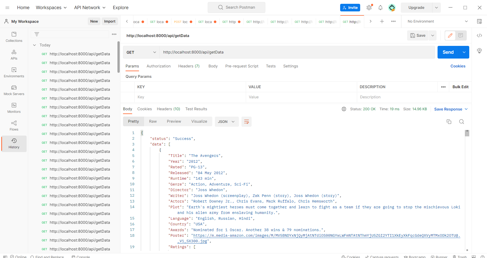
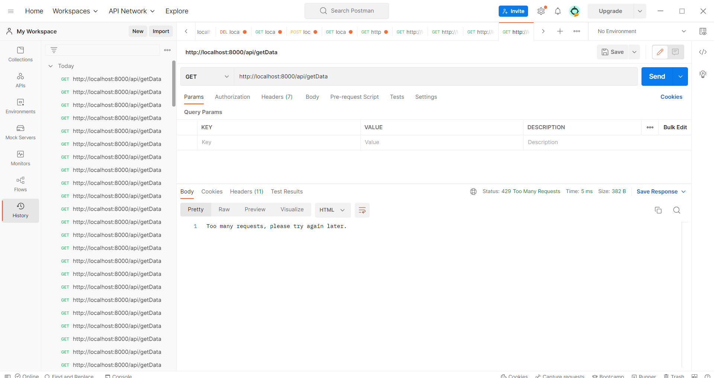

                                    How to run my project on your local System.

1. ## my project run on the postman to check.
   `localhost:8000/api/getData`

1. ## this is beginning external api fecthing request.
 
1. ## This output is after external api fetch 15 request/minute.

  